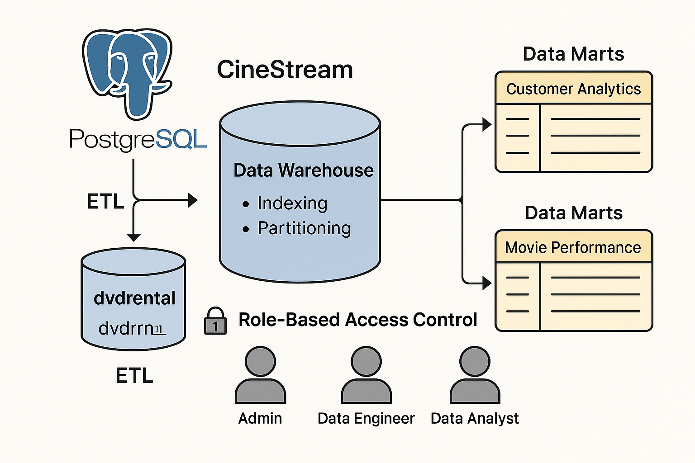

# Data_modelling_for_cinestream_with_postgres
 Designing and Building CineStream Data Warehouse: Turning Rentals into Insights

The warehouse was designed using demensional modeling principles to integrate and optimize data from operational dvdrental database.

This project delivers a fully functional data warehouse solution for CineStream, a digital movie rental platform. The warehouse was designed using dimensional modeling principles to integrate and optimize data from the operational dvdrental database. 
 

---
## Key Features  
- **Data Warehouse Schema (dvddw):** Structured for analytical workloads with fact and dimension tables.  
- **Data Marts:** Created for targeted business functions, such as *Customer Analytics* and *Movie Performance Insights*.  
- **ETL Pipeline Design:** Extracted, transformed, and loaded operational data into the warehouse for accurate, consistent reporting.  
- **Performance Optimization:**  
  - Indexed key foreign keys (`user_id`, `stock_id`) for faster joins.  
  - Created a **composite index** on `(stock_id, timestamp)` in `stock_prices` for time-series queries.  
  - Partitioned large tables (`transactions` quarterly, `stock_prices` monthly) to speed up historical queries and improve scalability.  
- **Role-Based Access Control (RBAC):** Implemented the principle of least privilege with secure, role-specific access:  
  - **Admin:** Full privileges, schema + role management.  
  - **Data Engineer:** DML operations + schema evolution (ETL pipelines).  
  - **Data Analyst:** Read-only access for safe reporting.  
  - **ML Engineer:** Selective read + write permissions for ML model outputs.  
--- 
**Indexing for performance:**  
CREATE INDEX idx_transactions_user_id ON transactions(user_id);
CREATE INDEX idx_stock_prices_composite ON stock_prices(stock_id, timestamp);
**Partitioning strategy:**
CREATE TABLE stock_prices_2025_01 PARTITION OF stock_prices
FOR VALUES FROM ('2025-01-01') TO ('2025-02-01');
**RBAC (Principle of Least Privilege):**
GRANT SELECT ON ALL TABLES IN SCHEMA dvddw TO data_analyst;
GRANT INSERT, UPDATE ON predicted_prices TO ml_engineer;

This warehouse supports business intelligence, reporting, and advanced analytics, enabling CineStream to:
Improve customer engagement insights
Track movie performance trends
Optimize inventory and revenue growth

With attention to  performance tuning and security governance, this project demonstrates real-world data engineering practices that scale.

